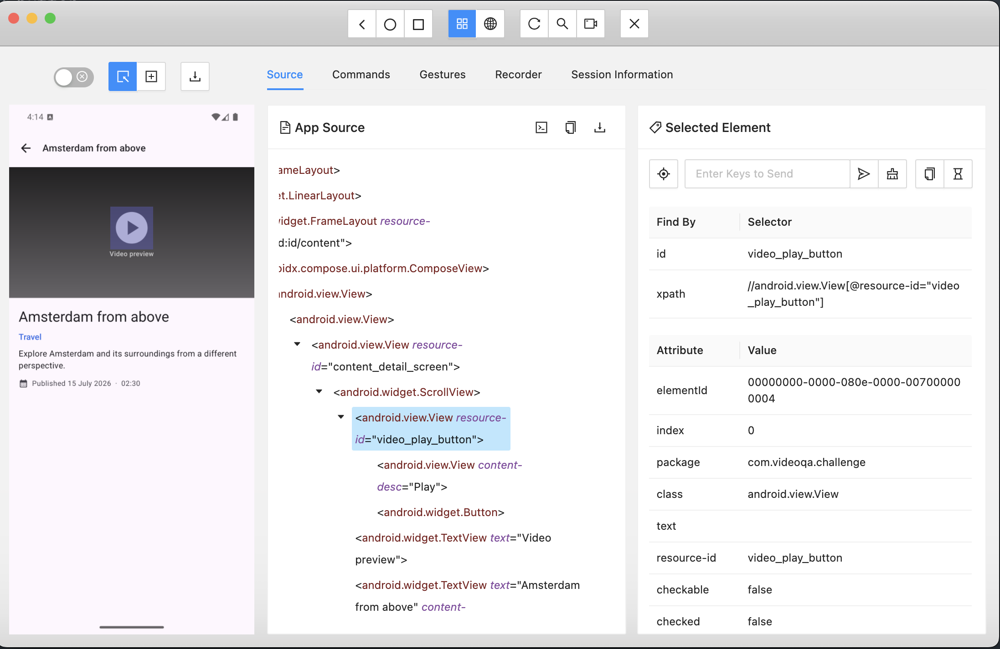
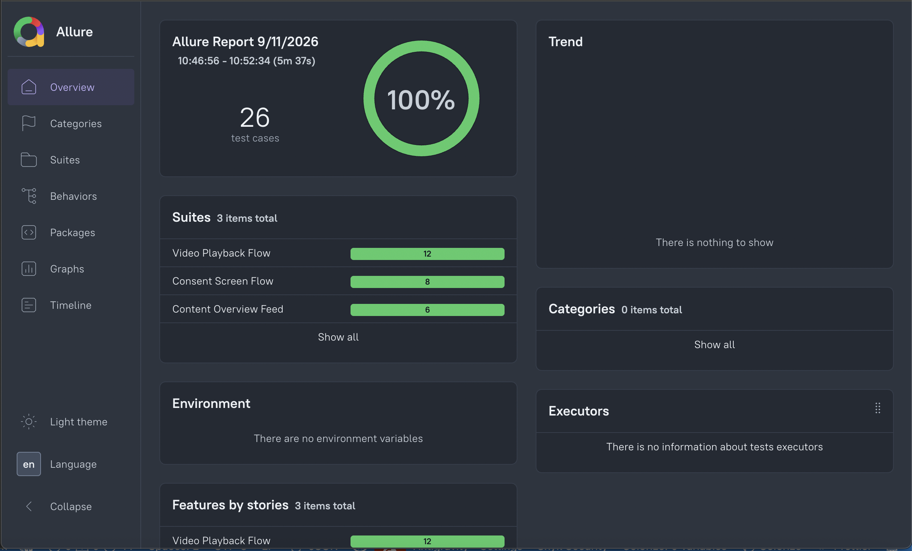
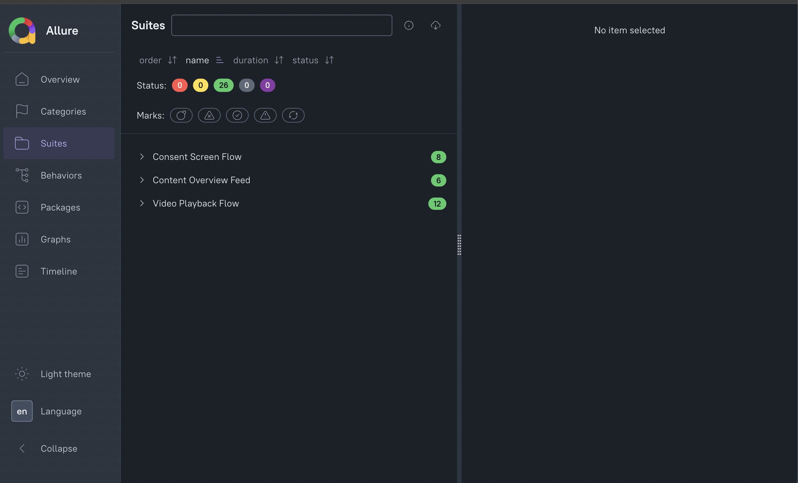
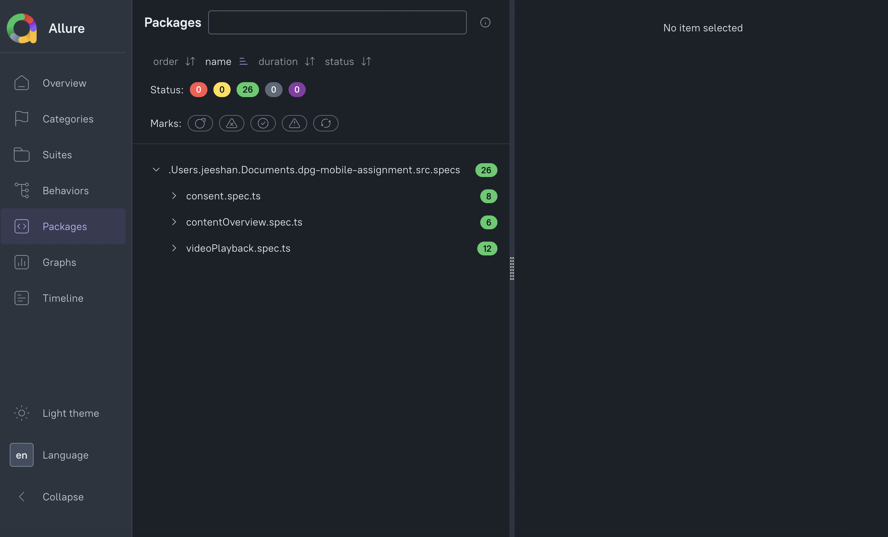

# Video QA Challenge - Cross-Platform Mobile Test Automation Framework

A cross-platform (Android & iOS) mobile test automation framework developed with **WebdriverIO v9**, **Appium 2.x**, **TypeScript**, **Mocha**, and **Allure Reporter** for the Video QA Challenge application.

[](https://jeeshan12.github.io/dpg-mobile-assignment/)

> 📊 **Live Interactive Report**: [https://jeeshan12.github.io/dpg-mobile-assignment/](https://jeeshan12.github.io/dpg-mobile-assignment/) (Android & iOS)

---

## 📑 Table of Contents

- [Actual Time Tracking & Effort Breakdown](#-actual-time-tracking--effort-breakdown)
- [Motivation Behind Chosen Tools & Approach](#-motivation-behind-chosen-tools--approach)
- [Architecture & Design Highlights](#architecture--design-highlights)
- [Tech Stack](#tech-stack)
- [Test Suites & Coverage Matrix](#test-suites--coverage-matrix)
- [Test Plan & Strategic Next Steps](#test-plan--strategic-next-steps)
- [AI Collaboration, Custom Skill & Learnings](#ai-collaboration-custom-skill--learnings)
- [Prerequisites & System Setup](#prerequisites--system-setup)
- [Installation & App Binaries](#installation--app-binaries)
- [Local Test Execution](#local-test-execution)
- [Self-Hosted Device Farm (@appium/device-farm)](#self-hosted-device-farm-appiumdevice-farm)
- [Quality Gates: TypeScript, ESLint, Prettier & Git Hooks](#quality-gates-typescript-eslint-prettier--git-hooks)
- [Test Reporting (Allure)](#test-reporting-allure)
- [Troubleshooting & FAQs](#troubleshooting--faqs)

## Actual Time Tracking & Effort Breakdown

As suggested in the assignment submission guidelines, below is the breakdown of actual time and effort invested across all development phases:

| Phase                                                | Activities & Focus Areas                                                                                                                                                                                                                                                                                                       | Actual Time Spent   |
| :--------------------------------------------------- | :----------------------------------------------------------------------------------------------------------------------------------------------------------------------------------------------------------------------------------------------------------------------------------------------------------------------------- | :------------------ |
| **Phase 1: Analysis & Overview**                     | • Analysed Android & iOS app repositories and README specifications.<br/>• Initialized WebdriverIO v9, Appium 2, TypeScript ~5.5, and wdio config (`wdio.conf.ts`).<br/>• Configured automated app binary fetch pipeline (`scripts/fetch-apps.sh`).                                                                            | **2-2.5 hours**     |
| **Phase 2: Page Object Model Design**                | • Designed `BaseScreen.ts` cross-platform locator abstraction layer (`byId`, `byText`, dynamic coordinate tap helpers).<br/>• Implemented screen classes for Consent, Preferences, Content Overview, Content Detail, Video Player, and Debug Options.                                                                          | **3.5 hours**       |
| **Phase 3: E2E Test Suite Implementation**           | • Test scenarios covering Consent persistence, Overview refresh/error states, and full Video Playback lifecycle (100% completion, buffering, pause/resume, errors).<br/>• Migrated static assertions to WebdriverIO native auto-retrying matchers (`await expect(...)`).                                                       | **4.0 - 4.5 hours** |
| **Phase 4: Appium Inspector & Debugging**            | • Verified runtime view hierarchies on live Android Emulators & iOS Simulators via **Appium Inspector**.<br/>• Fixed toggle switch tap behavior via bounding box coordinate calculation ([Appium Pro #22](https://appium.pro/editions/22-making-your-appium-tests-fast-and-reliable-part-4-dealing-with-unfindable-elements)). | **1.5 hours**       |
| **Phase 5: Quality Gates & Open-Source Device Farm** | • Enforced strict TypeScript compilation, ESLint (`plugin:wdio/recommended`), Prettier, and Husky + lint-staged pre-commit hooks.<br/>• Integrated `@appium/device-farm` with live Web Dashboard and resolved Node 24 `bplist-parser: 0.3.2` dependency override.                                                              | **1.0 hour**        |
| **Phase 6: Reporting & Documentation**               | • Configured Allure reporting and automated 1-click GitHub Pages deployment (`npm run report:deploy`).<br/>• Authored comprehensive README covering architecture, test plan, AI usage notes, and execution guides.                                                                                                             | **2 hours**         |
| **Total Effort**                                     | **Full Cross-Platform Framework Implementation**                                                                                                                                                                                                                                                                               | **~14-15 hours**    |

---

## Motivation Behind Chosen Tools & Approach

The assignment permits choosing between cross-platform tools (**WebdriverIO + Appium + TypeScript**) or native test frameworks (**XCUITest / Compose UI tests**). Below is the strategic rationale for our architectural selection:

### Why WebdriverIO v9 + Appium 2.x + TypeScript Was Chosen:

1. **Unified Cross-Platform Codebase (Single Test Suite for Android & iOS)**:
   - Writing native tests would require building and maintaining two completely separate codebases (Kotlin/Java with Compose UI / Espresso for Android, and Swift with XCUITest for iOS).
   - WebdriverIO allows **100% test logic reuse** through a single Page Object Model, drastically reducing maintenance overhead and preventing feature drift between platforms.
2. **Strict Type Safety & Modern Tooling**:
   - TypeScript guarantees compile-time validation for page elements, action methods, and capability configurations, preventing runtime typos.
3. **Advanced Synchronization & Native Retrying Matchers**:
   - WebdriverIO v9 includes built-in async expectation polling (`await expect(el)...`), ensuring reliable, deterministic synchronization without fragile static sleeps.
4. **Extensibility to Real Device Farms & Open-Source Grids**:
   - Appium 2's modular architecture allows plug-and-play integration with `@appium/device-farm` for local device pooling, or commercial clouds (BrowserStack/SauceLabs) via standard W3C capabilities.
5. **Rich Reporting Ecosystem**:
   - Native integration with Allure Framework generates interactive HTML reports with execution timelines and attachments, readily publishable to GitHub Pages.

---

## Architecture & Design Highlights

1. **Page Object Model (POM)**:
   - Clean separation of UI locators, platform abstractions, and test specifications.
   - `BaseScreen` provides cross-platform locator resolution (Android accessibility IDs/resource IDs vs iOS accessibility labels/names) and unified touch/gesture helpers.
2. **Auto-Retrying Assertions**:
   - Replaced static assertions with WebdriverIO's native assertion system (`await expect(element)...`).
   - Native matchers automatically poll the DOM/view hierarchy with retries, eliminating sleep-based flakiness.
3. **Deterministic App State & Fast Timing**:
   - Leverages app launch intent arguments (Android) and launch environment flags (iOS) to accelerate content delay and video buffering (`contentDelayMs: 800`, `videoBufferingMs: 800`) and enforce clean state resets (`resetAllState: true`).
4. **Session Isolation**:
   - Automatic `browser.reloadSession()` executed prior to each test scenario ensures 100% state independence without cross-test pollution.

---

## Tech Stack

| Technology                                                                                                 | Purpose                                               |
| :--------------------------------------------------------------------------------------------------------- | :---------------------------------------------------- |
| **[WebdriverIO v9](https://webdriver.io/)**                                                                | Modern Next-Gen Test Automation Runner                |
| **[Appium 2.x](https://appium.io/)**                                                                       | Mobile WebDriver Protocol Server                      |
| **[UiAutomator2 Driver](https://github.com/appium/appium-uiautomator2-driver)**                            | Android Automation Engine                             |
| **[XCUITest Driver](https://github.com/appium/appium-xcuitest-driver)**                                    | iOS Automation Engine                                 |
| **[@appium/device-farm](https://github.com/AppiumTestDistribution/appium-device-farm)**                    | Open-Source Private Mobile Device Cloud & Grid Plugin |
| **[TypeScript ~5.5](https://www.typescriptlang.org/)**                                                     | Strict Type Safety & Clean Compilation                |
| **[Mocha](https://mochajs.org/)**                                                                          | BDD Test Framework                                    |
| **[Allure Framework](https://allurereport.org/)**                                                          | Rich Interactive Visual Reporting                     |
| **[ESLint](https://eslint.org/) & [Prettier](https://prettier.io/)**                                       | Static Code Analysis, Best Practices & Formatting     |
| **[Husky](https://typicode.github.io/husky/) & [lint-staged](https://github.com/lint-staged/lint-staged)** | Pre-commit Quality Gate Automation                    |

---

## Test Suites & Coverage Matrix

The suite covers **13 comprehensive end-to-end test scenarios** across both Android and iOS:

### 1. Consent Screen (`src/specs/consent.spec.ts`)

- **Initial UI & Content**: Verifies consent dialog header, descriptive text, and primary action buttons.
- **Accept All Flow**: Verifies tapping "Accept All" persists consent and transitions directly to the Content Overview.
- **Reject Optional Flow**: Verifies tapping "Reject Optional" persists consent and transitions to the Content Overview.
- **Manage Preferences Modal**: Verifies modal display, toggle switches for granular consent preferences, saving choices, and transition to Overview.

### 2. Content Overview Screen (`src/specs/contentOverview.spec.ts`)

- **Feed Display & Refresh**: Verifies feed title, item cards (thumbnails, titles, descriptions), and pull-to-refresh functionality.
- **Server Error State & Retry**: Tests system response when content fails to load, asserting error banner visibility and successful retry recovery.
- **Empty State & Retry**: Validates empty list placeholder behavior and subsequent refresh/retry to populate content.

### 3. Video Playback & Detail Screen (`src/specs/videoPlayback.spec.ts`)

- **Detail Metadata & Auto-play**: Verifies clicking a feed card opens Detail view, displays correct title/description, and begins playback.
- **Playback Controls (Pause / Resume)**: Verifies tapping video pauses playback (showing Play icon and Paused status) and resuming continues playback.
- **Back Navigation**: Verifies navigating back returns to the Content Overview screen with state preserved.
- **Playback Error State & Retry**: Simulates video stream failure, asserting error overlay display and retry recovery.
- **Video Buffering Lifecycle**: Handles buffering spinner overlays and ensures smooth transition back to Playing state.
- **Full Video Completion**: Verifies video playback reaches 100% completion, elapsed time matches video duration, and completion overlay appears.

---

## Test Plan & Strategic Next Steps

### 1. Current Test Plan & Prioritization Strategy (Phase 1 Implemented)

Our initial test automation phase targeted the **critical user journeys** and highest-risk functional paths across both Android and iOS platforms:

- **Onboarding**: Verified that users’ consent choices (Accept, Reject, or Custom Preferences) are correctly applied and remembered when they reopen the app.
- **Content Discovery**: Tested feed loading, refresh, and how the app handles server errors or empty data.
- **Core Video Playback Engine**: Tested key playback states (Playing, Paused, Buffering, Completed).

---

### 2. Next Scenarios to Cover (Future Expansion Scope)

To expand test coverage into edge cases, platform capabilities, and non-functional requirements, we would implement the following test suites:

#### A. Deep-Linking & Intent Routing

- **Direct Video Ingestion**: Launching the app via custom URI schemes / Universal Links (e.g. `videoqa://details?id=sample_video_2`) and verifying direct navigation to the target video without consent re-prompting if already granted.
- **Invalid Deep-link Fallback**: Handling malformed or non-existent video IDs by redirecting safely to Content Overview with an appropriate user toast.

#### B. Network & Offline scnearios

- **Mid-Stream Network Dropout**: Toggling airplane mode during active 100% video playback to assert that buffering spinner appears, followed by a graceful offline retry banner.
- **Bandwidth Throttling (2G / 3G / High Latency)**: Validating the video playback using different bandwidth throttling.

#### C. App Lifecycle & System Interruptions

- **Backgrounding / Foregrounding**: Minimizing the app mid-playback and resuming to ensure the audio/video session preserves pause/play state and elapsed playback position.
- **System Interruptions**: Simulating incoming phone calls, push notifications, or alarm alerts to verify its imapct on ongoing videos.

#### D. Device Orientations

- **Dynamic Rotation (Portrait ↔ Landscape)**: Testing mid-video rotation to ensure seamless transition to full-screen player mode without restarting stream buffers.
- **Foldables & Tablets**: Validating responsiveness of video player on different devices.

### 3. Identified Risks & Mitigation Strategies

| Risk                            | Impact                                                                                                  | Mitigation Strategy                                                                                                                                                 |
| :------------------------------ | :------------------------------------------------------------------------------------------------------ | :------------------------------------------------------------------------------------------------------------------------------------------------------------------ |
| **Video streaming issues**      | Slow servers or video buffering can cause tests to fail even when the app itself is working correctly.  | **Mitigation**: Use app launch timing flags (`--ei videoBufferingMs 800`) and mock local HTTP video feeds for deterministic timing to control flakiness.            |
| **Slow iOS UI**                 | Complex SwiftUI screens can make automated tests slow when finding buttons or other elements.           | **Mitigation**: Configure `waitForQuiescence: false`, enforce explicit accessibility identifiers (`accessibilityIdentifier`), and use optimized predicate locators. |
| **Simulator / Emulator issues** | Old cache, data, or settings from previous tests can affect new test runs.                              | **Mitigation**: Enforce `browser.reloadSession()` with `-resetAllState` launch flags before every test.                                                             |
| **Different OS versions**       | Different Android/iOS versions may behave differently, which can cause tests to fail on some versions.. | **Mitigation**: Configure tests with version-specific settings so they work correctly across different OS versions..                                                |

---

### 5. Open Questions for Engineering & Product Stakeholders

1. **Video Playback Resume vs. Restart Behavior**:
   - _Question_: When a user navigates back from the video detail screen to the feed and opens the same video again, should playback resume from the last watched timestamp (saved progress), or should it always restart from 0:00??
2. **App Backgrounding & Picture-in-Picture (PiP)**:
   - _Question_: What is the intended behavior when the user minimizes the app or locks their screen mid-playback? Should video playback pause automatically, or should it enter Picture-in-Picture (PiP) mode / continue background audio?
3. **Network Recovery: Automatic Reconnect vs. Manual Retry**:
   - _Question_: When a video stream fails due to a network dropout, should the player automatically attempt to reconnect and resume playback once the network is restored, or is the user required to explicitly tap the "Retry" button?
4. **Offline Download**:
   - _Question_: Is there a capability to download offline videos?

---

## AI Collaboration, Custom Skill & Learnings

To accelerate development, I integrated AI into our workflow. Below is a transparent breakdown of how AI was used, where it excelled, where it failed, and how custom skills were engineered to standardize test creation.

---

### 1. Custom Skill Engineering (`generate-mobile-tests`)

We created a specialized agent skill located in [`.agent/skills/generate-mobile-tests/SKILL.md`](file:///.agent/skills/generate-mobile-tests/SKILL.md) to codify our framework's best practices and automation standards:

- **Standardized Page Object & Spec Templates**: Provides strict guidelines for cross-platform selector patterns, method encapsulation, and session lifecycle handling.
- **Enforcing Auto-Retrying Matchers**: Instructs AI to avoid fragile manual `browser.pause()` sleeps and shallow boolean assertions, mandating WebdriverIO's native expectation matchers (`await expect(...)`).
- **Enabling Fast, Scalable Authoring**: Future engineers (and AI subagents) can reference this skill file to generate new test specs and screen objects matching the exact architecture of the existing codebase.

---

### 2. Where AI Provided High Value (Wins)

1. **Framework Scaffolding & Tooling**:
   - Generated the initial TypeScript configuration, WebdriverIO v9 multi-config setup (`wdio.shared.conf.ts`, `wdio.android.conf.ts`, `wdio.ios.conf.ts`), ESLint rules, Prettier config, and Husky git hooks rapidly.
2. **Complex Touch Coordinate & Offset Calculations (Appium Pro #22)**:
   - On the **Manage Preferences Screen**, tapping toggle switches directly caused clicks to land in non-tappable whitespace on certain device resolutions. Drawing inspiration from [Appium Pro #22: Dealing with Unfindable Elements](https://appium.pro/editions/22-making-your-appium-tests-fast-and-reliable-part-4-dealing-with-unfindable-elements) (which details how to interact with elusive elements using bounding boxes and relative coordinate offsets), we prompted the AI with this technical pattern. The AI then assisted in calculating precise element rect dimensions and generating relative pointer click actions in `BaseScreen.ts` to reliably flip the toggles.
3. **Intent & Launch Flag Parameterization**:
   - Identified and implemented Android Intent arguments (`contentDelayMs: 800`, `videoBufferingMs: 800`, `resetAllState: true`) and iOS process environment variables to make 100% video playback fast and deterministic.
4. **Appium Device Farm Integration & Troubleshooting**:
   - Accelerated the integration of `@appium/device-farm` and helped diagnose a breaking change in `bplist-parser@0.5.0` under Node 24, crafting the appropriate npm `overrides` fix in `package.json`.

---

### 3. Where AI Struggled & Required Human QE Intervention (Failures & Course Corrections)

1. **Static Code Analysis vs. Runtime UI (Broken Locators)**:
   - _Problem_: AI initially extracted locators by analyzing the application's GitHub source code. However, several declared test tags and resource IDs did not map to the actual runtime UI hierarchy (particularly on SwiftUI on iOS, where nested accessibility traits and containers mask child elements).
   - _QE Action_: I used **Appium Inspector** on live Android Emulators and iOS Simulators to inspect the true view hierarchies, replacing static assumptions with stable accessibility labels and UIAutomator/XCUITest predicates.

   <p align="center">
     
   </p>

2. **Shallow vs. Deep State Assertions**:
   - _Problem_: AI initially generated shallow assertions (e.g. merely checking `toBeDisplayed()` without validating the actual functional state or content).
   - _QE Action_: I intervened by providing concrete examples of deep state assertions (validating switch toggle boolean states, comparing formatted video duration timestamps `00:10 / 00:10`, and asserting error banner recovery) and defined these rules in the custom skill.
3. **Mocha `beforeEach` vs. WDIO Session Lifecycle**:
   - _Problem_: AI defaulted to standard Mocha `beforeEach` hooks for test setup, which failed when combined with WebdriverIO's `beforeTest` session reloads (`browser.reloadSession()`).
   - _QE Action_: Re-architected all test setups to execute explicitly inside each `it()` block to ensure true isolation.

---

### 4. AI Prompts Used During Development

As suggested in the assignment submission guidelines, below are representative examples of prompts used to guide AI during development:

#### Prompt 1: Initial Page Object Scaffolding & Locator Abstraction

> _"Analyze the Video QA Challenge Android (Compose) and iOS (SwiftUI) repositories. Generate a Page Object Model architecture referencing current implemented `BaseScreen` that resolves accessibility IDs/resource IDs on Android and accessibility labels on iOS. Taking current implemented `ConsentScreen` as a reference screen encapsulate all screen actions for ContentOverviewScreen, and VideoPlayerScreen."_

#### Prompt 2: Handling Elusive Switch Taps via Coordinate Offsets (Appium Pro #22)

> _"On iOS, clicking directly on the `analytics_toggle` element lands in non-tappable row whitespace due to SwiftUI element trait boundaries. Refer to Appium Pro #22 and implement a relative pointer action helper in `BaseScreen.ts` that queries the element bounding box dimensions `(x, y, width, height)` and executes a precise tap offset directly on the switch toggle."_

#### Prompt 3: Appium Device Farm Configuration & Dependency Resolution

> _"Configure the Appium 2 `@appium/device-farm` plugin with a custom `appium-device-farm.json` and a dedicated `wdio.devicefarm.conf.ts` for dynamic Android & iOS device pooling. Troubleshoot the Node 24 runtime exception in `bplist-parser` and configure the appropriate npm override in `package.json`."_

#### Prompt 4: Utilise skill to generate new spec

> _"Using the `generate-mobile-tests` skill, generate a new test specification for transition to `Completed` state when video playback finishes."_

#### Prompt 5: Refactoring Existing Tests

> _"Review src/specs/videoPlayback.spec.ts against the generate-mobile-tests skill checklist to ensure all assertions use deep state validation."_

---

### 5. Summary

AI functioned as a powerful velocity multiplier for repetitive boilerplate and mathematical coordinate debugging. However, **human Quality Engineering domain expertise, live Appium Inspector debugging, and explicit feedback loops** were vital to achieving a rock-solid, 100% passing cross-platform test suite.

---

## Prerequisites & System Setup

### 1. System Requirements

- **macOS** (required for iOS Simulator testing; Linux/macOS supported for Android)
- **Node.js**: `v20.x` or `v22.x` (LTS recommended)
- **Java JDK**: `17` or `21` (configured in `JAVA_HOME`)

### 2. Android Setup

1. Install **Android Studio** and the **Android SDK**.
2. Configure environment variables in `~/.zshrc` or `~/.bash_profile`:
   ```bash
   export ANDROID_HOME=$HOME/Library/Android/sdk
   export PATH=$PATH:$ANDROID_HOME/emulator:$ANDROID_HOME/platform-tools
   ```
3. Create and launch an Android Virtual Device (e.g. `Pixel 8 Pro - API 34`).

### 3. iOS Setup (macOS only)

1. Install **Xcode** (15+ / 16+) from the Mac App Store and install Command Line Tools:
   ```bash
   xcode-select --install
   ```
2. Open Xcode, navigate to **Settings > Platforms**, and install an iOS Simulator (e.g. iOS 18.x).

### 4. Appium 2 Setup

Ensure Appium and required drivers are installed:

```bash
npm install -g appium
appium driver install uiautomator2
appium driver install xcuitest
```

---

## Installation & App Binaries

### 1. Clone & Install Dependencies

```bash
git clone https://github.com/jeeshan12/dpg-mobile-assignment.git
cd dpg-mobile-assignment
npm install
```

_(Husky Git hooks are initialized automatically during `npm install`)_

### 2. App Binaries Management

Application binaries are automatically downloaded before any test execution via `pretest` lifecycle hooks. You can also manually fetch/update them anytime:

```bash
npm run fetch:apps
```

This script downloads:

- **Android APK**: `apps/android/VideoQAChallenge-debug.apk`
- **iOS Simulator App**: `apps/ios/VideoQAChallenge.app` (extracted from the zip archive, and temporary `.zip` files are cleaned up automatically).

---

## Local Test Execution

### 1. Run Android Tests

Ensure an Android emulator is booted, then run:

```bash
npm run test:android
```

### 2. Run iOS Tests

Ensure an iOS simulator is booted, then run:

```bash
npm run test:ios
```

### 3. Run Full Cross-Platform Suite

Runs all specs sequentially across both platforms:

```bash
npm test
```

### 4. Run Specific Test Specs

Use the `--spec` argument to target specific test files:

```bash
npx wdio run config/wdio.android.conf.ts --spec src/specs/consent.spec.ts
npx wdio run config/wdio.ios.conf.ts --spec src/specs/videoPlayback.spec.ts
```

---

## Self-Hosted Device Farm (`@appium/device-farm`)

The framework includes support for **Appium Device Farm**, an open-source alternative to commercial cloud device grids (such as BrowserStack or Sauce Labs). It provides dynamic device allocation, simulator management, and a live web dashboard.

### 1. Start Appium with Device Farm

```bash
npm run appium:farm
```

### 2. Open the Live Web Dashboard

Open your browser and navigate to:
👉 **[http://127.0.0.1:4723/device-farm](http://127.0.0.1:4723/device-farm)**

The dashboard displays:

- Real-time device inventory (connected Android emulators/devices and iOS simulators)
- Live device availability (`FREE` vs `BUSY`)
- Real-time video/screen streaming of tests executing on devices
- Session history and execution metrics

### 3. Execute Tests Against Device Farm

In a separate terminal, execute:

```bash
# Run tests dynamically across available devices in the farm
npm run test:farm

# Target Android devices on the farm
npm run test:farm:android

# Target iOS simulators on the farm
npm run test:farm:ios
```

---

## Quality Gates: TypeScript, ESLint, Prettier & Git Hooks

To ensure high code standards, strict typing, and zero regressions, this repository enforces multiple automated quality gates.

### 1. Available Quality Scripts

```bash
# TypeScript strict type check (zero emission check)
npx tsc --noEmit

# ESLint static code analysis (WDIO + TypeScript rules)
npm run lint

# Auto-fix ESLint issues
npm run lint:fix

# Prettier code formatting check
npm run format:check

# Auto-format codebase with Prettier
npm run format
```

### 2. Automated Git Pre-Commit Hooks (Husky + lint-staged)

The repository uses **Husky (v9)** and **lint-staged** configured in `.husky/pre-commit` and `.lintstagedrc.json`.

Whenever you run `git commit`:

1. `lint-staged` runs `eslint --fix` and `prettier --write` on all staged `.ts`, `.json`, and `.md` files.
2. `tsc --noEmit` runs full TypeScript compilation to prevent any type errors from being committed.
3. If any check fails, the commit is blocked until the issue is fixed.

---

## Test Reporting (Allure)

Test results are recorded in JUnit and Allure formats under `reports/`.

### 🌐 Live Hosted Report (GitHub Pages)

👉 **[Open Live Interactive Allure Report (Android & iOS)](https://jeeshan12.github.io/dpg-mobile-assignment/)**

---

### Test Execution Environment & Selection Criteria

| Parameter                | Android Environment                                  | iOS Environment                          |
| :----------------------- | :--------------------------------------------------- | :--------------------------------------- |
| **Device Model**         | Google Pixel 8 Pro (Emulator / AVD)                  | iPhone 16 (Simulator)                    |
| **Operating System**     | Android 14.0 (API Level 34 - `x86_64` / `arm64-v8a`) | iOS 18.6 (Xcode 16 Runtime)              |
| **Automation Driver**    | `appium-uiautomator2-driver` (~8.6.1)                | `appium-xcuitest-driver` (~12.11.1)      |
| **Execution Layer**      | Local CLI Runner & `@appium/device-farm`             | Local CLI Runner & `@appium/device-farm` |
| **Suite Execution Time** | ~02 min 51 sec (13 specs passed)                     | ~03 min 23 sec (13 specs passed)         |

#### Why This Environment Was Chosen:

1. **Deterministic Isolation & Clean State Resets**:
   - Emulators and Simulators allow complete application sandboxing and instant cache wipes (`browser.reloadSession()` combined with `-resetAllState` launch flags).
2. **Launch Intent & Timing Acceleration**:
   - Both Android AVD and iOS Simulator runtimes allow injection of launch intent extras and environment flags (`--ei contentDelayMs 800 --ei videoBufferingMs 800`). This accelerates synthetic network delays from 4+ seconds down to 800ms, making 100% video playback tests fast, deterministic, and free of timing flakiness.
3. **Modern Target OS Baseline**:
   - Target SDKs using environment variables to run on different android and IOS versions against emulators/simulators
4. **Zero-Cost Scalability & Cloud Device Farm Ready**:
   - Pairing local AVDs/Simulators with `@appium/device-farm` provides a self-hosted private cloud grid with dynamic pooling and web dashboards at zero recurring subscription cost.

---

### Local Report Generation & Deployment

```bash
# 1. Generate the interactive HTML report from test results
npm run report:generate

# 2. Open the report in your default browser locally
npm run report:open

# 3. Publish the report to GitHub Pages (no CI/Actions needed!)
npm run report:deploy
```

### Report Previews

#### 1. Allure Executive Dashboard

<p align="center">
  
</p>

#### 2. Test Suites Execution Overview

<p align="center">
  
</p>

#### 3. Packages & Test Specs Breakdown

<p align="center">
  
</p>

---

## Troubleshooting & FAQs

#### 1. Why is `"overrides": { "bplist-parser": "0.3.2" }` in `package.json`?

`bplist-parser` v0.5.0 introduced a breaking change removing the legacy `.UID` constructor, which causes runtime errors in `appium-ios-device`. Locking `bplist-parser` to `0.3.2` ensures stable Appium iOS and Device Farm plugin compatibility on modern Node versions.

#### 2. Tests fail with "Session not created"

- For **Android**: Ensure `adb devices` shows your emulator as `device` and `ANDROID_HOME` is set.
- For **iOS**: Ensure the simulator name and iOS version match your installed Xcode simulator (or configure `IOS_SIMULATOR_NAME` / `IOS_PLATFORM_VERSION` env vars).

#### 3. How are tests kept isolated between runs?

The framework automatically triggers `browser.reloadSession()` before each test in `wdio.shared.conf.ts` combined with `-resetAllState` launch flags, ensuring clean cache and fresh app state on every run.
